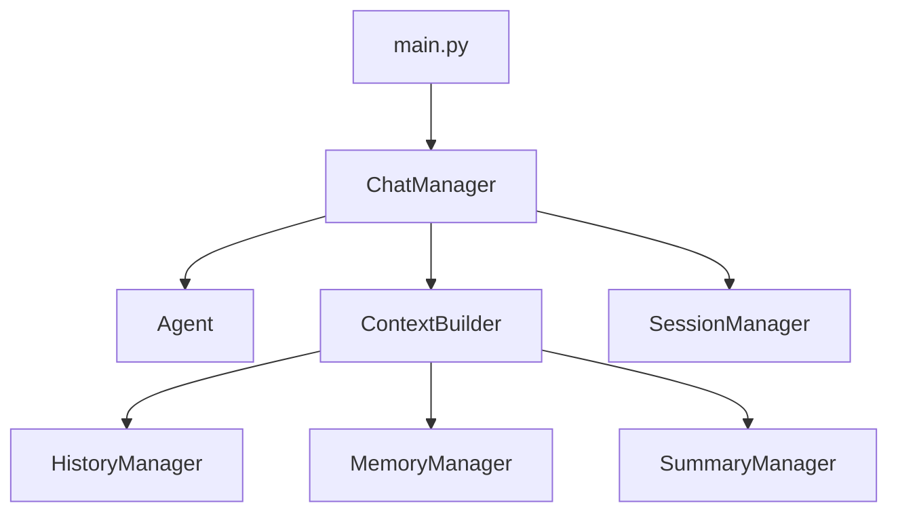
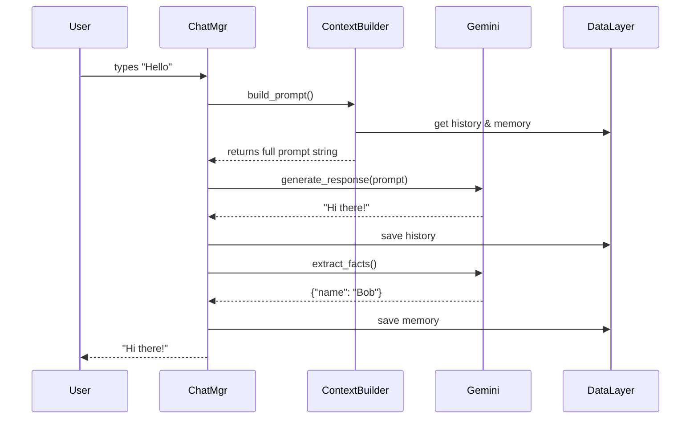

# Diagrams

## Component Diagram

```mermaid
graph TD
    A[main.py] --> B[ChatManager]
    B --> C[Agent]
    B --> D[ContextBuilder]
    B --> E[SessionManager]
    D --> F[HistoryManager]
    D --> G[MemoryManager]
    D --> H[SummaryManager]
```

## Data Flow Diagram

```mermaid
sequenceDiagram
    participant User
    participant ChatMgr
    participant ContextBuilder
    participant Gemini
    participant DataLayer

    User->>ChatMgr: types "Hello"
    ChatMgr->>ContextBuilder: build_prompt()
    ContextBuilder->>DataLayer: get history & memory
    ContextBuilder-->>ChatMgr: returns full prompt string
    ChatMgr->>Gemini: generate_response(prompt)
    Gemini-->>ChatMgr: "Hi there!"
    ChatMgr->>DataLayer: save history
    ChatMgr->>Gemini: extract_facts()
    Gemini-->>ChatMgr: {"name": "Bob"}
    ChatMgr->>DataLayer: save memory
    ChatMgr-->>User: "Hi there!"
```
